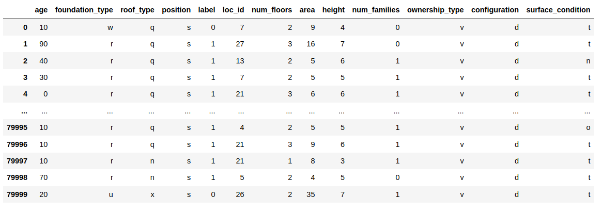

# ML101 Practial 2 - Random Forest 

In this exercise we are going to try to predict apartment prices in Yerevan. It should be simple, right? ;) The bigger the apartment, the higher the price! But by how much?

The practical focuses on achieving good predictive results. Probably having 20,000 USD error margin is good, anything higher than that, your model probably isn't worth much. So spend some time improving the features you create, and try to get the error score lower, but remember not to overfit to the training data!

## The data

The dataset mainly consists of information on the buildings' structure and their legal ownership. Each row in the dataset represents a specific building in the region that was hit by earthquake. Here is a snapshot:

The data is stored in a csv file `data/train.csv` 

## Process

### To get good score, you need to understand the data well.
